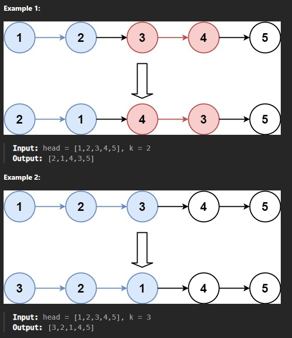

# TWO POINTER PROBLEMS

### Problem 2: Remove Duplicates from a Sorted Array In-Place

**Problem Statement:**
Given a sorted array `arr`, remove the duplicates in-place such that each unique element appears only once. The relative order of the elements should be kept the same, and it should be done in **O(1)** extra space. You must modify the input array in-place with the result being stored in the first part of the array, and return the length of the unique elements.

**Example:**

- **Input:** `[2, 3, 3, 3, 6, 9, 9]`
- **Explanation:**
  - The sorted input array has duplicates.
  - We need to modify the array in such a way that each unique element appears only once and the duplicates are removed.
  - Use two pointers:
    - One pointer (`i`) keeps track of where to place the next unique element.
    - Another pointer (`j`) iterates through the entire array.
  - After processing, the first `4` elements of the array will be `[2, 3, 6, 9]` representing unique values.
- **Output:** Length of unique elements = `4`

**Approach:**

- Use the **Two Pointers** technique:
  - The first pointer, `i`, keeps track of the index where the next unique element should be placed.
  - The second pointer, `j`, iterates through the array.
- Since the array is sorted, duplicates are always adjacent. As `j` iterates, if the element at `j` is different from the element at `i - 1`, we have found a new unique element, and we place it at index `i`.

**Python Code with Comments:**

```python
def remove_duplicates(arr):
    # If the array is empty, return 0
    if not arr:
        return 0

    # Initialize the unique element pointer
    i = 1

    # Iterate through the array starting from the second element
    for j in range(1, len(arr)):
        # If the current element is not equal to the previous element
        # It means we have found a unique element
        if arr[j] != arr[i - 1]:
            arr[i] = arr[j]  # Place the unique element at index 'i'
            i += 1           # Increment the unique index pointer

    # Return the length of unique elements
    return i

# Example usage
arr = [2, 3, 3, 3, 6, 9, 9]
length = remove_duplicates(arr)
print(f"Length of unique elements: {length}")  # Output: 4
print(f"Modified array (first {length} elements): {arr[:length]}")  # Output: [2, 3, 6, 9]
```

**Explanation of the Code:**

1. **Initialization:**

   - If the input array is empty, simply return `0`.
   - Start with `i = 1` as the pointer for placing the next unique element.
2. **Iteration Through the Array:**

   - Start iterating from index `1` using the `j` pointer.
   - Compare `arr[j]` with the element at `i - 1` (the last placed unique element).
   - If `arr[j]` is different from `arr[i - 1]`, it means that `arr[j]` is unique and should be placed at the current position of `i`.
   - After placing the unique element, increment `i` to point to the next position.
3. **Return Value:**

   - The value `i` represents the length of the array that contains unique elements.
   - The array itself is modified in-place, with the unique elements placed in the first `i` positions.

**Time Complexity:**

- **O(n)**, where `n` is the length of the array. We only iterate through the array once.

**Space Complexity:**

- **O(1)**, since we are modifying the array in place and not using any extra space.

**Summary**

- The **Two Pointers** technique is used effectively to remove duplicates from a sorted array in **O(n)** time and **O(1)** space.
- The `i` pointer keeps track of where to place the next unique element, while the `j` pointer iterates through the array.
- By keeping the original sorted order and modifying the array in place, this solution is both time and space efficient.

### Problem 3: Triplet Sum to Zero

**Problem Statement:**
Given an array of integers `arr`, find all unique triplets in the array which give the sum of zero. The solution set must not contain duplicate triplets.

**Example:**

- **Input:** `[-3, -1, 1, 2, -1, -4]`
- **Explanation:**
  - To find all unique triplets that add up to zero, sort the array first.
  - Iterate through the sorted array and use two pointers to find pairs that sum up with the current element to give zero.
  - Possible unique triplets: `[-3, 1, 2]` and `[-1, -1, 2]`.
- **Output:** `[[-3, 1, 2], [-1, -1, 2]]`

**Approach:**

- The **Two Pointers** technique is used in combination with sorting.
- **Steps:**
  1. **Sort the Array:** Sort the input array to make it easier to find unique combinations and avoid duplicates.
  2. **Fixed Pointer and Two Pointers:**
     - Iterate through the sorted array with a pointer `i`.
     - For each element at `i`, use two pointers (`left` and `right`) to find pairs whose sum is equal to the negative value of the current element (`-arr[i]`).
  3. **Avoid Duplicates:** Skip elements that are the same as the previous one to ensure each triplet is unique.

**Python Code with Comments:**

```python
def three_sum(arr):
    # Sort the array to make it easier to find unique combinations
    arr.sort()
    # List to store the unique triplets that sum to zero
    result = []

    # Iterate through the array, considering each element as a potential part of a triplet
    for i in range(len(arr) - 2):
        # Skip duplicate elements to avoid duplicate triplets
        if i > 0 and arr[i] == arr[i - 1]:
            continue

        # Set up two pointers: one starting just after 'i' and the other at the end of the array
        left, right = i + 1, len(arr) - 1

        # While 'left' is to the left of 'right', try to find a valid triplet
        while left < right:
            # Calculate the current sum of the triplet
            current_sum = arr[i] + arr[left] + arr[right]

            # If the current sum is zero, we found a triplet
            if current_sum == 0:
                result.append([arr[i], arr[left], arr[right]])

                # Move the left pointer to the right while skipping duplicates
                while left < right and arr[left] == arr[left + 1]:
                    left += 1
                # Move the right pointer to the left while skipping duplicates
                while left < right and arr[right] == arr[right - 1]:
                    right -= 1

                # Move both pointers to continue finding other potential triplets
                left += 1
                right -= 1
            # If the current sum is less than zero, move the left pointer to increase the sum
            elif current_sum < 0:
                left += 1
            # If the current sum is greater than zero, move the right pointer to decrease the sum
            else:
                right -= 1

    # Return the list of unique triplets
    return result

# Example usage
arr = [-3, -1, 1, 2, -1, -4]
print(three_sum(arr))  # Output: [[-3, 1, 2], [-1, -1, 2]]
```

**Explanation of the Code:**

1. **Sorting the Array:**

   - The array is sorted to facilitate the use of two pointers and to make it easier to skip duplicate elements.
2. **Iterating with a Fixed Pointer:**

   - Use a for loop to iterate through the array, treating each element as a potential part of the triplet.
   - The index `i` represents the first element of the triplet.
3. **Two-Pointer Technique:**

   - For each element at index `i`, use two pointers:
     - **`left`** starts just after `i`.
     - **`right`** starts at the end of the array.
   - Move the `left` and `right` pointers to find pairs that, together with `arr[i]`, sum to zero.
4. **Handling Duplicates:**

   - Skip duplicate elements for `i`, `left`, and `right` to avoid generating duplicate triplets.

**Time Complexity:**

- Sorting the array takes **O(n log n)**.
- The two-pointer search for each element takes **O(n)**.
- Therefore, the overall complexity is **O(n^2)**.

**Space Complexity:**

- **O(1)**, not counting the space required for the output. No additional space is used apart from the input and output.

**Summary**

- The **Two Pointers** technique is combined with sorting to efficiently find triplets that sum to zero.
- The sorted array allows the use of two pointers (`left` and `right`) to find pairs that, together with the current element (`arr[i]`), form a triplet that sums to zero.
- Careful handling of **duplicates** is crucial to ensure that the solution set contains only unique triplets.

### Problem 7: Sort Colors (Dutch National Flag Problem)

**Problem Statement:**
Given an array `arr` with `n` objects colored red, white, or blue, represented by integers `0`, `1`, and `2`, respectively, sort them in-place so that objects of the same color are adjacent, with the colors in the order `red (0)`, `white (1)`, and `blue (2)`.

**Note:** You are not supposed to use the library's sort function for this problem. The idea is to use a single pass (O(n)) and in-place sorting (O(1) space).

**Example:**

- **Input:** `[2, 0, 2, 1, 1, 0]`
- **Explanation:**
  - Use the **Dutch National Flag algorithm**, which involves using three pointers (`low`, `mid`, `high`) to segregate the values in a single pass.
  - After processing, the array should be sorted as `[0, 0, 1, 1, 2, 2]`.
- **Output:** `[0, 0, 1, 1, 2, 2]`

**Approach:**

- Use three pointers:
  - **`low`**: Keeps track of the position where `0`s should be placed.
  - **`mid`**: Current element to be checked.
  - **`high`**: Keeps track of the position where `2`s should be placed.
- Initially, set `low = 0`, `mid = 0`, and `high = len(arr) - 1`.
- Iterate through the array until `mid` exceeds `high`:
  - If `arr[mid] == 0`: Swap `arr[low]` and `arr[mid]`, then increment both `low` and `mid`.
  - If `arr[mid] == 1`: Just increment `mid`.
  - If `arr[mid] == 2`: Swap `arr[mid]` and `arr[high]`, then decrement `high`.

**Python Code with Comments:**

```python
def sort_colors(arr):
    # Initialize three pointers: 'low', 'mid', and 'high'
    low, mid, high = 0, 0, len(arr) - 1

    # Iterate until 'mid' crosses 'high'
    while mid <= high:
        if arr[mid] == 0:
            # Swap the current element with the element at 'low'
            arr[low], arr[mid] = arr[mid], arr[low]
            # Increment both 'low' and 'mid' pointers
            low += 1
            mid += 1
        elif arr[mid] == 1:
            # If the element is '1', move the 'mid' pointer forward
            mid += 1
        else:  # arr[mid] == 2
            # Swap the current element with the element at 'high'
            arr[mid], arr[high] = arr[high], arr[mid]
            # Decrement the 'high' pointer
            high -= 1

# Example usage
arr = [2, 0, 2, 1, 1, 0]
sort_colors(arr)
print(arr)  # Output: [0, 0, 1, 1, 2, 2]
```

**Explanation of the Code:**

1. **Initialization:**

   - Three pointers are used:
     - `low` (starting from `0`) tracks where the next `0` should be placed.
     - `mid` (starting from `0`) is used to iterate through the array.
     - `high` (starting from the last index) tracks where the next `2` should be placed.
2. **Iterate Through the Array:**

   - If `arr[mid] == 0`:
     - Swap the element at `mid` with the element at `low`.
     - This ensures that `0`s are moved to the beginning.
     - Increment both `low` and `mid`.
   - If `arr[mid] == 1`:
     - Simply move the `mid` pointer to the next element.
     - `1`s are already in the correct position.
   - If `arr[mid] == 2`:
     - Swap the element at `mid` with the element at `high`.
     - This ensures that `2`s are moved to the end.
     - Decrement `high`.
     - Note that after swapping, the `mid` pointer is **not incremented** because we need to recheck the new value at `mid` (since it was just swapped).

**Time Complexity:**

- **O(n)** where `n` is the length of the array. Each element is processed at most once.

**Space Complexity:**

- **O(1)** since no additional space is used other than the input array.

**Summary**

- The **Dutch National Flag Algorithm** is an efficient solution for this problem.
- By using three pointers (`low`, `mid`, `high`), the array is partitioned into three regions:
  - Elements less than `1` (`0`s) are placed at the beginning.
  - Elements equal to `1` are placed in the middle.
  - Elements greater than `1` (`2`s) are placed at the end.
- This approach runs in **O(n)** time and **O(1)** space, making it very efficient for in-place sorting.

# Fast and Slow Pointers

### Problem 3: Linked List Cycle Length

**Problem**: Given a linked list, find the length of the cycle (if it exists).

**Example**:

- **Input**: Linked list: 1 → 2 → 3 → 4 → 2 (Cycle starts at node with value `2`)
- **Output**: `3`
- **Explanation**: The linked list has a cycle starting at node `2` and the cycle length is `3`. The nodes forming the cycle are `2 → 3 → 4 → 2`. To determine the length, we can use the fast and slow pointers to detect the cycle and then determine its length by counting the nodes involved.

**Step-by-Step Solution**:

1. **Detect if a Cycle Exists**:

   - Use the Fast and Slow Pointers method to detect if a cycle is present.
   - The **slow pointer** moves one step at a time while the **fast pointer** moves two steps.
   - If there is a cycle, the fast and slow pointers will eventually meet.
2. **Determine the Length of the Cycle**:

   - Once a cycle is detected (both pointers meet at the same node), keep one pointer fixed and move the other until it meets the fixed pointer again.
   - Count the number of steps taken to determine the cycle length.

**Visualization**:

```
1 → 2 → 3 → 4
    ↑       ↓
    5 ←-----
```

In this example, the cycle is formed by nodes `2 → 3 → 4`, and the length of this cycle is `3`.

**Python Code with Detailed Comments**:

```python
class ListNode:
    def __init__(self, value=0, next=None):
        self.value = value
        self.next = next

def cycle_length(head):
    # Step 1: Detect if a cycle exists using slow and fast pointers
    slow, fast = head, head
  
    # Traverse the linked list
    while fast is not None and fast.next is not None:
        slow = slow.next           # Move slow pointer by one step
        fast = fast.next.next      # Move fast pointer by two steps

        # If slow and fast meet, a cycle is detected
        if slow == fast:
            return count_cycle_length(slow)  # Step 2: Calculate the cycle length
  
    return 0  # No cycle found

def count_cycle_length(meeting_node):
    # Start from the meeting node
    current = meeting_node
    length = 0
  
    # Traverse the cycle until we reach the starting point again
    while True:
        current = current.next  # Move to the next node in the cycle
        length += 1             # Increment the length count
        if current == meeting_node:  # If we are back at the start, stop
            break
  
    return length

# Example usage:
# Create a linked list with a cycle: 1 -> 2 -> 3 -> 4 -> 5 -> 3 (cycle starts at 3)
head = ListNode(1)
head.next = ListNode(2)
head.next.next = ListNode(3)
head.next.next.next = ListNode(4)
head.next.next.next.next = ListNode(5)
head.next.next.next.next.next = head.next.next  # Create a cycle back to node 3

print(cycle_length(head))  # Output: 3
```

- **Time Complexity**:

  - **Cycle Detection**: The time complexity of detecting a cycle is **O(N)**, where **N** is the number of nodes in the linked list. This is because, in the worst case, we need to traverse the entire list until the fast pointer catches up to the slow pointer.
  - **Cycle Length Calculation**: Once the cycle is detected, the time complexity of counting the cycle length is **O(C)**, where **C** is the length of the cycle. In the worst case, **C** could be all the nodes in the list.
  - Therefore, the overall time complexity is **O(N)**.
- **Space Complexity**:

  - The space complexity is **O(1)** because we only use a constant amount of extra space (two pointers, `slow` and `fast`, and a few additional variables).

**Summary**

- **Fast and Slow Pointers** are used to detect a cycle.
- Once a cycle is detected, **counting the length** is done by fixing one pointer and moving another until it completes the cycle.
- The solution is efficient, requiring only **O(N)** time and **O(1)** space, making it suitable for large linked lists.

## Problem 5: Intersection of Two Linked Lists

**Problem**: Given two singly linked lists, determine if they intersect, and return the intersecting node. Intersection is defined based on reference, not value; if the same node is shared between the two linked lists, they intersect at that node.

**Example**:

- **Input**:
  - **List A**: `1 → 2 → 3 → 4 → 5`
  - **List B**: `9 → 4 → 5`
- **Output**: `Node with value 4`
- **Explanation**: Both lists intersect at the node with value `4`. This means they share the same reference from that point onward.

**Visualization**:

```
List A: 1 → 2 → 3 → 4 → 5
                      ↑
List B:         9 → 4
```

The lists intersect at node `4`.

**Approach to Solve the Problem**

1. **Two Pointers Technique**:
   - Use two pointers, one for each list (`pointerA` and `pointerB`).
   - Traverse each list simultaneously.
   - When a pointer reaches the end of its list, move it to the head of the other list.
   - If the lists intersect, the two pointers will meet at the intersection point after swapping heads once. If they do not intersect, both pointers will reach the end (`None`) at the same time.

**Detailed Explanation**

- **Initialization**:
  - Start with two pointers, one at the head of each list (`pointerA` at the head of List A, and `pointerB` at the head of List B).
- **Traversing**:
  - Move each pointer one step at a time.
  - When a pointer reaches the end of its list, redirect it to the head of the other list.
- **Meeting Point**:
  - If there is an intersection, both pointers will eventually meet at the intersection node.
  - If there is no intersection, both pointers will reach the end (`None`) simultaneously.

**Python Code with Detailed Comments**

```python
class ListNode:
    def __init__(self, value=0, next=None):
        self.value = value
        self.next = next

def get_intersection_node(headA, headB):
    # If either list is empty, there can be no intersection
    if headA is None or headB is None:
        return None

    # Initialize two pointers, starting at the heads of both lists
    pointerA, pointerB = headA, headB

    # Traverse both lists until the pointers meet or reach the end
    while pointerA != pointerB:
        # If pointerA reaches the end of List A, redirect it to the head of List B
        pointerA = pointerA.next if pointerA is not None else headB
  
        # If pointerB reaches the end of List B, redirect it to the head of List A
        pointerB = pointerB.next if pointerB is not None else headA

    # Either both pointers are None (no intersection) or they meet at the intersection node
    return pointerA

# Example usage:
# Create intersecting linked lists:
# List A: 1 -> 2 -> 3 -> 4 -> 5
# List B: 9 -> 4 -> 5
headA = ListNode(1)
headA.next = ListNode(2)
headA.next.next = ListNode(3)
intersection = ListNode(4)
intersection.next = ListNode(5)
headA.next.next.next = intersection

headB = ListNode(9)
headB.next = intersection

# Find intersection node
result = get_intersection_node(headA, headB)
if result:
    print(f"Intersecting Node: {result.value}")  # Output: Intersecting Node: 4
else:
    print("No intersection")
```

**Complexity Analysis**

- **Time Complexity**: **O(M + N)**, where **M** is the length of List A and **N** is the length of List B.
  - The worst case is when we traverse both lists entirely (when there is no intersection).
- **Space Complexity**: **O(1)**.
  - The solution uses only constant space (two pointers) and does not require any additional data structures.

**Key Points**

- The **two-pointer technique** ensures that both pointers traverse the entire length of both lists.
- If the lists intersect, the pointers will meet at the intersection node after switching heads once.
- If there is no intersection, both pointers will reach `None` at the same time.

This approach guarantees that the intersection node is found efficiently without extra memory, making it optimal for large linked lists.

# In-Place LinkedList

### Problem 22: Reverse Every k Nodes in a Linked List

**Explanation**

You are given a linked list and an integer `k`. Your task is to reverse the linked list in groups of `k` nodes at a time. If there are fewer than `k` nodes left at the end, they should not be reversed.



**Example:**

- **Input**: `1 → 2 → 3 → 4 → 5 → 6 → 7 → 8`, `k = 3`
- **Explanation**:
  - Reverse the first group of `3` nodes: `1 → 2 → 3` becomes `3 → 2 → 1`.
  - Reverse the second group of `3` nodes: `4 → 5 → 6` becomes `6 → 5 → 4`.
  - Nodes left after groups of `3` are: `7 → 8`, and they are left as is.
- **Output**: `3 → 2 → 1 → 6 → 5 → 4 → 7 → 8`

The challenge is to perform this reversal in-place, meaning you cannot use extra space for storing nodes (e.g., a list or array).

**Approach:**

We use an iterative approach to traverse through the linked list and reverse nodes in chunks of `k`. We'll have pointers to track the start and end of the sub-lists that need to be reversed, and carefully adjust pointers to achieve the desired result.

**Python Code:**

```python
class ListNode:
    def __init__(self, val=0, next=None):
        self.val = val
        self.next = next

def reverse_k_group(head, k):
    # Step 1: Create a dummy node to act as the new head
    dummy = ListNode(0)
    dummy.next = head
    group_prev = dummy

    # Function to find the k-th node from the given start node
    def get_kth_node(start, k):
        current = start
        count = 0
        while current and count < k:
            current = current.next
            count += 1
        return current

    while True:
        # Step 2: Find the k-th node from the current group start
        kth = get_kth_node(group_prev, k)
        if not kth:
            break  # Less than k nodes remaining, stop processing
  
        # Step 3: Reverse k nodes
        group_next = kth.next
        prev, current = group_next, group_prev.next
  
        # Reverse k nodes
        for _ in range(k):
            next_node = current.next
            current.next = prev
            prev = current
            current = next_node

        # Step 4: Update the pointers for the previous group
        new_group_start = group_prev.next
        group_prev.next = prev
        group_prev = new_group_start

    return dummy.next

# Helper function to print the linked list
def print_linked_list(head):
    current = head
    while current:
        print(current.val, end=" -> " if current.next else "\n")
        current = current.next

# Example usage
# Creating the linked list: 1 -> 2 -> 3 -> 4 -> 5 -> 6 -> 7 -> 8
nodes = [ListNode(i) for i in range(1, 9)]
for i in range(len(nodes) - 1):
    nodes[i].next = nodes[i + 1]

k = 3
print("Original Linked List:")
print_linked_list(nodes[0])

print("\nReversed in Groups of k:")
new_head = reverse_k_group(nodes[0], k)
print_linked_list(new_head)
```

**Complexity Analysis:**

- **Time Complexity**: `O(n)`

  - We traverse each node of the linked list a constant number of times (`n` is the number of nodes in the linked list).
  - The main traversal and the reversal process are linear in time, which gives an overall time complexity of `O(n)`.
- **Space Complexity**: `O(1)`

  - The reversal is performed in-place, meaning we only use a constant amount of extra space for pointers.
  - No additional data structures are used that grow in size relative to the input.

This solution effectively reverses every `k` nodes in the linked list while maintaining `O(n)` time complexity and `O(1)` space complexity, making it both efficient and optimal for this type of in-place linked list manipulation.

### Problem 25: Reverse Linked List in Groups and Merge with Original Order

**Problem Explanation**

You are given a linked list and an integer `k`. The task is to:

1. Reverse nodes in groups of `k`.
2. Merge the reversed nodes with the original linked list.

**Example:**

- **Input**: `1 → 2 → 3 → 4 → 5 → 6`, `k = 2`
- **Step-by-Step Explanation**:
  1. **Reverse the Nodes in Groups**:
     - First group (`1 → 2`): Reverse to `2 → 1`.
     - Second group (`3 → 4`): Reverse to `4 → 3`.
     - Third group (`5 → 6`): Reverse to `6 → 5`.
  2. **Merge the Reversed Groups with Original Order**:
     - Merge each reversed group (`2 → 1`, `4 → 3`, `6 → 5`) with their corresponding positions in the original linked list.
- **Output**: `1 → 2 → 2 → 1 → 3 → 4 → 4 → 3 → 5 → 6 → 6 → 5`

The challenge involves both reversing the nodes and then merging them effectively without additional space.

**Solution Approach**

We use an iterative approach where we traverse through the linked list twice:

1. **Reverse the Groups**: Reverse nodes in chunks of `k`.
2. **Merge with Original Order**: Merge the nodes with the original list as they appear.

**Python Code with Detailed Comments**

Below is a Python implementation that solves the problem:

```python
class ListNode:
    def __init__(self, val=0, next=None):
        self.val = val
        self.next = next

def reverse_k_group_and_merge(head, k):
    # Step 1: Reverse nodes in groups of k
    dummy = ListNode(0)
    dummy.next = head
    group_prev = dummy

    def get_kth_node(start, k):
        # Finds the kth node from the start node
        current = start
        count = 0
        while current and count < k:
            current = current.next
            count += 1
        return current

    while True:
        # Find the k-th node from the current position
        kth = get_kth_node(group_prev, k)
        if not kth:
            break  # Not enough nodes to form a group of k

        # Reverse k nodes
        group_next = kth.next
        prev, current = group_next, group_prev.next

        for _ in range(k):
            next_node = current.next
            current.next = prev
            prev = current
            current = next_node

        # Connect with previous part
        new_group_start = group_prev.next
        group_prev.next = prev
        group_prev = new_group_start

    # Step 2: Merge with the original linked list
    # Create two pointers to merge the original and reversed parts
    original = head
    reversed_head = dummy.next

    merged_dummy = ListNode(0)
    merged_current = merged_dummy

    while original and reversed_head:
        # Merge one node from original, then one from reversed
        merged_current.next = original
        original = original.next
        merged_current = merged_current.next

        merged_current.next = reversed_head
        reversed_head = reversed_head.next
        merged_current = merged_current.next

    return merged_dummy.next

# Helper function to print the linked list
def print_linked_list(head):
    current = head
    while current:
        print(current.val, end=" -> " if current.next else "\n")
        current = current.next

# Example usage
# Creating the linked list: 1 -> 2 -> 3 -> 4 -> 5 -> 6
nodes = [ListNode(i) for i in range(1, 7)]
for i in range(len(nodes) - 1):
    nodes[i].next = nodes[i + 1]

k = 2
print("Original Linked List:")
print_linked_list(nodes[0])

print("\nReversed and Merged Linked List:")
new_head = reverse_k_group_and_merge(nodes[0], k)
print_linked_list(new_head)
```

**Complexity Analysis**

- **Time Complexity**: `O(n)`

  - The entire list is traversed a constant number of times (`n` is the number of nodes in the list).
  - The main traversal, the reversing process, and the merging process are all linear, resulting in an overall time complexity of `O(n)`.
- **Space Complexity**: `O(1)`

  - The solution performs the reversal in-place without using any additional data structures that grow with the input size.
  - The space used is constant, making the space complexity `O(1)`.

**Summary**

This solution effectively:

1. **Reverses** nodes in groups of `k`.
2. **Merges** the nodes with the original list, ensuring every `k` nodes are merged back with their original order.

It maintains an `O(n)` time complexity and `O(1)` space complexity, making it both efficient and optimal for in-place linked list manipulation.

Certainly! Let's go through Problem 5, **Evaluate Reverse Polish Notation**.

---

# Stack Based Problems

### Problem 5: Evaluate Reverse Polish Notation (RPN)

**Description**:
Given an expression in Reverse Polish Notation (RPN), evaluate its value. The RPN is a mathematical notation where every operator follows all of its operands. You are guaranteed that the input will be valid.

**Supported Operators**: `+`, `-`, `*`, `/` (integer division).

- **Addition (`+`)**: Adds two numbers.
- **Subtraction (`-`)**: Subtracts the second operand from the first.
- **Multiplication (`*`)**: Multiplies two numbers.
- **Division (`/`)**: Divides the first operand by the second, performing integer division. The result should be truncated towards zero.

**Example**:

- **Input**: `["2", "1", "+", "3", "*"]`
- **Output**: `9`

**Explanation**:

1. **"2"** and **"1"** are numbers, so push them onto the stack.
2. **"+"** means add the top two elements on the stack (2 + 1 = 3), so pop the top two, compute the result, and push `3` back onto the stack.
3. **"3"** is a number, so push it onto the stack.
4. **"*"** means multiply the top two elements on the stack (3 * 3 = 9), so pop the top two, compute the result, and push `9` back onto the stack.
5. The final stack has a single value, which is `9`.

**Solution Approach:**

We use a **stack** to handle this problem efficiently:

1. **Iterate** through each token in the input list.
2. **If the token is a number**, push it onto the stack.
3. **If the token is an operator** (`+`, `-`, `*`, `/`):
   - Pop the top two elements from the stack.
   - Perform the operation using the two popped numbers.
   - Push the result back onto the stack.
4. After processing all tokens, the stack will contain a single element, which is the result.

**Detailed Walkthrough of Example:**

For the input `["2", "1", "+", "3", "*"]`:

1. Start with an empty stack: `[]`.
2. Push `2`: `[2]`
3. Push `1`: `[2, 1]`
4. Encounter `"+"`:
   - Pop `1` and `2`.
   - Compute `2 + 1 = 3`.
   - Push `3` back onto the stack: `[3]`
5. Push `3`: `[3, 3]`
6. Encounter `"*"`:
   - Pop `3` and `3`.
   - Compute `3 * 3 = 9`.
   - Push `9` back onto the stack: `[9]`
7. The final result is `9`.

**Python Code:**

```python
def eval_rpn(tokens):
    stack = []

    for token in tokens:
        if token in "+-*/":
            # Pop the two top-most elements
            b = stack.pop()
            a = stack.pop()

            # Perform the respective operation
            if token == "+":
                stack.append(a + b)
            elif token == "-":
                stack.append(a - b)
            elif token == "*":
                stack.append(a * b)
            elif token == "/":
                # Integer division towards zero
                stack.append(int(a / b))
        else:
            # If the token is a number, push it to the stack
            stack.append(int(token))
  
    # The final result is the last item in the stack
    return stack.pop()

# Example usage
tokens = ["2", "1", "+", "3", "*"]
print(eval_rpn(tokens))  # Output: 9
```

**Explanation of the Code:**

1. **Stack Initialization**: We start with an empty `stack`.
2. **Loop through Tokens**:
   - For each token:
     - If it’s a number, we push it onto the stack.
     - If it’s an operator, we pop the two top numbers, apply the operation, and push the result.
3. **Final Result**: At the end, the only element left in the stack is the result, which we return.

**Edge Cases:**

1. **Single Number**: If the input is a single number (e.g., `["4"]`), the result is that number itself.
2. **Negative Numbers**: Handle cases with negative numbers correctly.
3. **Integer Division**: Division should truncate towards zero, so `int(a / b)` ensures integer division that truncates towards zero.

This approach runs in **O(n)** time, where `n` is the number of tokens, because we only push and pop each token once, making it very efficient.

Sure! Let's go through **Problem 6: Largest Rectangle in Histogram**.

---

### Problem 6: Largest Rectangle in Histogram

**Description**:
Given an array of integers where each element represents the **height of a histogram bar**, find the area of the largest rectangle that can be formed within the bounds of the histogram.

**Example**:

- **Input**: `[2, 1, 5, 6, 2, 3]`
- **Output**: `10`

**Explanation**:
For the given histogram `[2, 1, 5, 6, 2, 3]`, the largest rectangle has an area of `10`. This rectangle is formed by the heights `5` and `6` with a width of `2` (from index `2` to `3`).

**Approach: Monotonic Stack**

To solve this problem efficiently, we can use a **monotonic stack** to maintain the heights in increasing order, which helps in calculating the maximum area of a rectangle when we encounter a height that breaks the increasing order.

**Steps:**

1. **Initialize an empty stack** to store indices and a `max_area` variable to track the largest rectangle area.
2. **Iterate through each bar in the histogram**:
   - If the current bar height is less than the height at the index stored at the top of the stack, it indicates that a rectangle with the height of the top of the stack can’t extend further. We then calculate the area with this height.
   - To calculate the area:
     - **Pop the height** from the stack.
     - **Calculate the width** based on the distance to the current index and the index of the last item remaining in the stack.
   - Push the current index onto the stack.
3. **Handle remaining bars** in the stack after the loop to ensure any heights left in the stack are used for area calculations.

**Detailed Walkthrough of Example**

For the histogram `[2, 1, 5, 6, 2, 3]`:

1. Initialize `stack = []` and `max_area = 0`.
2. Traverse through the histogram:

   - **Index 0 (height 2)**: Push index `0` onto the stack → `stack = [0]`.
   - **Index 1 (height 1)**: Since `1 < 2`, pop `0`. Calculate area as `2 * 1 = 2`. Push `1` onto the stack → `stack = [1]`.
   - **Index 2 (height 5)**: Push `2` → `stack = [1, 2]`.
   - **Index 3 (height 6)**: Push `3` → `stack = [1, 2, 3]`.
   - **Index 4 (height 2)**: Since `2 < 6`, pop `3`. Area = `6 * 1 = 6`. Pop `2`, area = `5 * 2 = 10`. Update `max_area = 10`. Push `4` → `stack = [1, 4]`.
   - **Index 5 (height 3)**: Push `5` → `stack = [1, 4, 5]`.
3. **Remaining Elements**: After finishing the array, pop and calculate for each remaining index:

   - Pop `5`, area = `3 * 1 = 3`.
   - Pop `4`, area = `2 * 4 = 8`.

Final `max_area` is `10`.

**Python Code:**

```python
def largest_rectangle_area(heights):
    stack = []
    max_area = 0
    n = len(heights)

    for i in range(n):
        # Pop elements if the current height is less than the height of the top of the stack
        while stack and heights[i] < heights[stack[-1]]:
            height = heights[stack.pop()]  # Height of the popped bar
            width = i if not stack else i - stack[-1] - 1  # Width of the rectangle
            max_area = max(max_area, height * width)
    
        # Push current index onto stack
        stack.append(i)
  
    # Pop all remaining elements in the stack
    while stack:
        height = heights[stack.pop()]
        width = n if not stack else n - stack[-1] - 1
        max_area = max(max_area, height * width)
  
    return max_area

# Example usage
heights = [2, 1, 5, 6, 2, 3]
print(largest_rectangle_area(heights))  # Output: 10
```

**Explanation of Code:**

1. **Stack Initialization**: We start with an empty `stack` and `max_area = 0`.
2. **Traverse the Histogram**:
   - For each bar, if it’s shorter than the bar represented by the top index in the stack, pop from the stack and calculate the area. The width is calculated based on the position between the current index and the index at the top of the stack after popping.
   - Push each index onto the stack if the height is increasing or the stack is empty.
3. **Remaining Elements**: After the loop, calculate areas for remaining heights in the stack, using the length of the array as the boundary.

**Edge Cases:**

1. **Single Bar**: If there’s only one bar, the area is the height of that bar.
2. **Increasing Heights**: In cases like `[1, 2, 3, 4]`, all bars are pushed until the end, and the largest rectangle is the area of the smallest bar multiplied by the width of the entire histogram.
3. **All Bars of the Same Height**: In cases like `[2, 2, 2, 2]`, the largest rectangle is simply `height * length`.

**Complexity:**

- **Time Complexity**: O(n), where `n` is the number of bars in the histogram. Each bar is pushed and popped from the stack only once.
- **Space Complexity**: O(n), due to the stack used for storing indices.

Using a **monotonic stack** helps in managing heights efficiently, ensuring we only calculate the area when needed and maintaining a linear time complexity. This approach provides an optimal solution for finding the largest rectangle area in a histogram.

Sure! Let's go through **Problem 16: Trapping Rain Water**.

---

### Problem 16: Trapping Rain Water

**Description**:
Given `n` non-negative integers representing an elevation map where the width of each bar is `1`, compute how much water it can trap after raining.

**Example**:

- **Input**: `[0, 1, 0, 2, 1, 0, 1, 3, 2, 1, 2, 1]`
- **Output**: `6`


**Explanation**:
For the elevation map `[0, 1, 0, 2, 1, 0, 1, 3, 2, 1, 2, 1]`, the water trapped at each index is:

- At index `2` → `1` unit of water
- At index `4` → `1` unit
- At index `5` → `2` units
- At index `6` → `1` unit
- At index `9` → `1` unit

Adding up these values gives a total of `6` units of trapped water.

**Approach: Monotonic Stack**

To solve this efficiently, we use a **monotonic decreasing stack**. This approach leverages the idea of finding "boundaries" for each water trap:

1. **Identify lower and upper bounds** around each bar that could trap water.
2. The **left and right boundaries** around a lower bar will define how much water can be trapped.

**Steps:**

1. Initialize an empty stack and a variable `water_trapped` to accumulate the total trapped water.
2. Traverse through each bar in the elevation map:
   - If the current bar height is greater than the height at the index stored at the top of the stack, this indicates that water can be trapped above the top index in the stack.
   - To calculate trapped water:
     - Pop the top height from the stack.
     - Use the next height in the stack to define the width for trapped water and the minimum height difference to calculate the trapped water.
   - Push the current index onto the stack if it’s empty or if the height is less than the height at the top of the stack.

**Detailed Walkthrough of Example**

For the elevation map `[0, 1, 0, 2, 1, 0, 1, 3, 2, 1, 2, 1]`:

1. Initialize `stack = []` and `water_trapped = 0`.
2. Traverse through the elevation map:
   - **Index 0 (height 0)**: Push `0` → `stack = [0]`.
   - **Index 1 (height 1)**: Push `1` → `stack = [0, 1]`.
   - **Index 2 (height 0)**: Push `2` → `stack = [0, 1, 2]`.
   - **Index 3 (height 2)**:
     - Pop `2`. Water trapped = `(min(1, 2) - 0) * (3 - 1 - 1) = 1`. `water_trapped = 1`.
     - Pop `1`. Water trapped = `(min(0, 2) - 1) * (3 - 0 - 1) = 2`. `water_trapped = 3`.
   - **Index 4 (height 1)**: Push `4` → `stack = [0, 3, 4]`.
   - **Index 5 (height 0)**: Push `5` → `stack = [0, 3, 4, 5]`.
   - **Index 6 (height 1)**:
     - Pop `5`. Water trapped = `(min(2, 1) - 0) * (6 - 4 - 1) = 1`. `water_trapped = 4`.
   - **Index 7 (height 3)**: Pop and calculate water for `6`, `4`, and `3`.
3. **Final Result**: `water_trapped = 6`.

**Python Code:**

```python
def trap_rain_water(heights):
    stack = []
    water_trapped = 0

    for i, height in enumerate(heights):
        # Calculate water trapped if current height is greater than top of the stack
        while stack and height > heights[stack[-1]]:
            top = stack.pop()  # Pop the top of the stack
            if not stack:
                break  # No left boundary

            # Calculate the distance between left and right boundaries
            distance = i - stack[-1] - 1
            # Find the bounded height
            bounded_height = min(height, heights[stack[-1]]) - heights[top]
            water_trapped += distance * bounded_height
      
        # Push the current index onto the stack
        stack.append(i)
  
    return water_trapped

# Example usage
heights = [0, 1, 0, 2, 1, 0, 1, 3, 2, 1, 2, 1]
print(trap_rain_water(heights))  # Output: 6
```

**Explanation of Code:**

1. **Stack Initialization**: Start with an empty `stack` and set `water_trapped = 0`.
2. **Traverse the Heights**:
   - For each height:
     - If it’s greater than the height at the top index in the stack, this means a boundary is found, and water can be trapped.
     - **Calculate water trapped** based on the width and the bounded height between two boundaries.
     - Push the current index onto the stack if it’s not empty or if the height is less than the height at the top of the stack.
3. **Final Result**: `water_trapped` accumulates the total units of water trapped.

**Edge Cases:**

1. **No Trapped Water**: Flat heights like `[1, 1, 1]` or increasing heights `[1, 2, 3]` result in zero trapped water.
2. **Only One Bar**: With only one bar or no bars, no water can be trapped.
3. **Descending Heights**: For arrays like `[5, 4, 3, 2, 1]`, no water can be trapped, as there’s no boundary.

**Complexity:**

- **Time Complexity**: O(n), where `n` is the number of heights, since each height is processed once.
- **Space Complexity**: O(n), due to the stack used for storing indices.

Using a **monotonic stack** helps efficiently manage boundaries and enables an optimal solution for the problem. The above solution provides a way to calculate trapped rainwater by leveraging left and right boundaries to define each trapped segment.
