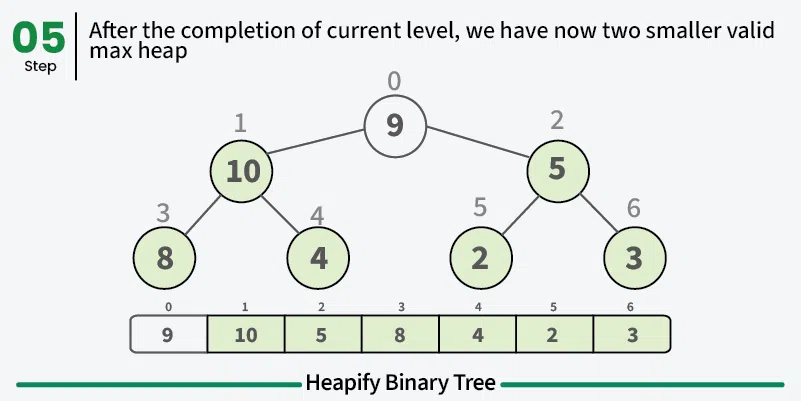

## 1. **Overview**:

Sorting algorithms are essential in computer science for organizing data into a particular order (e.g., ascending or descending). They are fundamental for enhancing the efficiency of data structures and algorithms. Sorting algorithms are generally classified into two types:

- **Comparison-based Sorting**: These algorithms compare elements and sort based on their relative values. Examples include Bubble Sort, Quick Sort, and Merge Sort.
- **Non-comparison-based Sorting**: These algorithms sort without comparing elements directly and often leverage specific properties of the input data. Examples include Counting Sort and Radix Sort.

**Real-world applications** of sorting algorithms include:

- **Database management**: Efficient sorting is vital for operations like retrieving data and performing quick lookups.
- **Search optimization**: Sorted data structures (e.g., binary search trees, B-trees) allow for faster search operations.
- **Scheduling and prioritization**: Sorting is used in task management and queue handling in operating systems.

## 2. **Algorithm List**:

### **Basic Comparison-based Algorithms**:

#### Bubble Sort

**Bubble Sort**: A simple algorithm that repeatedly swaps adjacent elements if they are in the wrong order.
**Complexity**: \( O(n^2) \) average/worst-case, \( O(n) \) best-case (already sorted).
**Visual Representation**

```
Initial Array: [5, 3, 8, 4, 2]

Pass 1: [3, 5, 4, 2, 8]
5,3 → 3,5 (swap)
5,8 → 5,8 (no swap)
8,4 → 4,8 (swap)
8,2 → 2,8 (swap)

Pass 2: [3, 4, 2, 5, 8]
3,5 → 3,5 (no swap)
5,4 → 4,5 (swap)
5,2 → 2,5 (swap)
5,8 → 5,8 (no swap)

...and so on
```

**Python Implementation:**

```python
def bubble_sort(arr):
    """
    Bubble Sort Algorithm
    Repeatedly steps through the list, compares adjacent elements, and swaps them if they are in the wrong order.
    The pass through the list is repeated until the list is sorted.
  
    Time Complexity:
        - Best Case: O(n) [when the list is already sorted]
        - Average and Worst Case: O(n^2)
  
    Space Complexity:
        - O(1) Auxiliary Space
    """
    n = len(arr)
    for i in range(n):
        # Flag to detect any swap
        swapped = False
        # Last i elements are already in place
        for j in range(0, n - i - 1):
            # Compare adjacent elements
            if arr[j] > arr[j + 1]:
                # Swap if elements are in wrong order
                arr[j], arr[j + 1] = arr[j + 1], arr[j]
                swapped = True
        # If no two elements were swapped in the inner loop, then the list is sorted
        if not swapped:
            break
    return arr

# Example Usage
if __name__ == "__main__":
    sample = [64, 34, 25, 12, 22, 11, 90]
    sorted_sample = bubble_sort(sample.copy())
    print("Bubble Sort:", sorted_sample)

```

**How It Works**
    1. Start with the first element
    2. Compare it with the next element
    3. If the first element is greater, swap them
    4. Move to the next pair of elements
    5. Repeat until no more swaps are needed

**Characteristics**
    - **Best for**: Educational purposes and tiny datasets
    - **Advantages**:
        - Simple to understand and implement
        - Requires no extra memory
        - Stable sorting algorithm
    - **Disadvantages**:
        - O(n²) complexity makes it inefficient for large datasets
        - Performs poorly even if the array is nearly sorted

#### Selection Sort

**Selection Sort**: Finds the minimum element and places it at the beginning, repeating for subsequent elements.**Complexity**: \( O(n^2) \) in all cases.
**Stability:** Unstable
**How It Works**

1. Find the minimum element in the unsorted portion
2. Swap it with the first element of the unsorted portion
3. Expand the sorted portion by one element
4. Repeat until all elements are sorted

**Visual Representation**

```
Initial Array: [64, 25, 12, 22, 11]

Find minimum (11):
[11 | 25, 12, 22, 64]   // 11 is now sorted

Find minimum in remaining (12):
[11, 12 | 25, 22, 64]   // 12 is now sorted

Find minimum in remaining (22):
[11, 12, 22 | 25, 64]   // 22 is now sorted

And so on...
```

**Characteristics**

- **Best for**: Small arrays and arrays with large elements but small keys
- **Advantages**:
  - Simple implementation
  - Performs well on small arrays
  - Minimizes number of swaps (O(n) swaps)
- **Disadvantages**:
  - O(n²) complexity
  - Not stable
  - No early termination possible

**Python Implementation:**

```python
def selection_sort(arr):
    """
    Selection Sort Algorithm
    Divides the input list into two parts: a sorted sublist and an unsorted sublist.
    Repeatedly selects the smallest (or largest) element from the unsorted sublist and moves it to the end of the sorted sublist.
  
    Time Complexity:
        - O(n^2) in all cases
  
    Space Complexity:
        - O(1) Auxiliary Space
    """
    n = len(arr)
    for i in range(n):
        # Assume the first element of unsorted sublist is the minimum
        min_idx = i
        # Iterate through unsorted sublist to find the actual minimum
        for j in range(i + 1, n):
            if arr[j] < arr[min_idx]:
                min_idx = j
        # Swap the found minimum element with the first element of unsorted sublist
        arr[i], arr[min_idx] = arr[min_idx], arr[i]
    return arr

# Example Usage
if __name__ == "__main__":
    sample = [29, 10, 14, 37, 13]
    sorted_sample = selection_sort(sample.copy())
    print("Selection Sort:", sorted_sample)

```

#### Insertion Sort

**Insertion Sort**: Insertion Sort works by building a sorted array one element at a time, similar to how most people sort playing cards in their hands. It takes each element from the unsorted portion and inserts it into its correct position in the sorted portion.
**Complexity**: \( O(n^2) \) average/worst-case, \( O(n) \) best-case.
**How It Works**
    1. Start with first element (considered sorted)
    2. Take next element
    3. Compare with sorted portion from right to left
    4. Shift larger elements to the right
    5. Insert element in correct position
    6. Repeat until all elements are sorted

**Visual Representation**

```
Initial Array: [5, 2, 4, 6, 1, 3]

Pass 1: (2 is selected)
[5 | 2, 4, 6, 1, 3]
[2, 5 | 4, 6, 1, 3]  // 2 inserted before 5

Pass 2: (4 is selected)
[2, 5 | 4, 6, 1, 3]
[2, 4, 5 | 6, 1, 3]  // 4 inserted between 2 and 5

Pass 3: (6 is selected)
[2, 4, 5 | 6, 1, 3]
[2, 4, 5, 6 | 1, 3]  // 6 remains at its position

Pass 4: (1 is selected)
[2, 4, 5, 6 | 1, 3]
[1, 2, 4, 5, 6 | 3]  // 1 inserted at beginning

Pass 5: (3 is selected)
[1, 2, 4, 5, 6 | 3]
[1, 2, 3, 4, 5, 6]   // 3 inserted between 2 and 4
```

**Characteristics**

- **Best for**:
  - Small datasets
  - Nearly sorted arrays
  - Online sorting (sorting as data arrives)
- **Advantages**:
  - Simple implementation
  - Stable sorting algorithm
  - Adaptive (runs faster on nearly sorted arrays)
  - In-place algorithm
  - Online algorithm (can sort as data arrives)
- **Disadvantages**:
  - O(n²) complexity for random data
  - Not suitable for large datasets

**Python Implementation:**

```python
def insertion_sort(arr):
    """
    Insertion Sort Algorithm
    Builds the sorted array one item at a time by repeatedly taking the next unsorted element and inserting it into the correct position in the sorted part.
  
    Time Complexity:
        - Best Case: O(n) [when the list is already sorted]
        - Average and Worst Case: O(n^2)
  
    Space Complexity:
        - O(1) Auxiliary Space
    """
    for i in range(1, len(arr)):
        key = arr[i]  # The element to be inserted
        j = i - 1
        # Move elements of arr[0..i-1], that are greater than key, to one position ahead
        while j >= 0 and arr[j] > key:
            arr[j + 1] = arr[j]
            j -= 1
        # Insert the key at after the element just smaller than it
        arr[j + 1] = key
    return arr

# Example Usage
if __name__ == "__main__":
    sample = [12, 11, 13, 5, 6]
    sorted_sample = insertion_sort(sample.copy())
    print("Insertion Sort:", sorted_sample)

```

#### Merge Sort

**Merge Sort**: A divide-and-conquer algorithm that splits arrays and merges them in sorted order.
**Complexity**: \( O(n \log n) \) in all cases. Stable sort.
**How It Works**

1. **Divide**: Split the array into two halves
2. **Conquer**: Recursively sort the two halves
3. **Combine**: Merge the sorted halves

**Representation**

```
   Original Array: [38, 27, 43, 3, 9, 82, 10]

   Divide Phase:
   [38, 27, 43, 3] [9, 82, 10]
   [38, 27] [43, 3] [9, 82] [10]
   [38] [27] [43] [3] [9] [82] [10]

   Merge Phase:
   [27, 38] [3, 43] [9, 82] [10]
   [3, 27, 38, 43] [9, 10, 82]
   [3, 9, 10, 27, 38, 43, 82]
```

**Characteristics**

- **Best for**: Large datasets, external sorting, parallel processing
- **Advantages**:
  - Guaranteed O(n log n) complexity
  - Stable sorting
  - Parallel-friendly
- **Disadvantages**:
  - Requires O(n) extra space
  - Overkill for small arrays
  - Not in-place

**Python Implementation:**

```python
def merge_sort(arr):
    if len(arr) <= 1:
        return arr
  
    mid = len(arr) // 2
    left = merge_sort(arr[:mid])
    right = merge_sort(arr[mid:])
  
    return merge(left, right)

def merge(left, right):
    result = []
    i = j = 0
  
    while i < len(left) and j < len(right):
        if left[i] <= right[j]:
            result.append(left[i])
            i += 1
        else:
            result.append(right[j])
            j += 1
  
    result.extend(left[i:])
    result.extend(right[j:])
    return result

# Time Complexity: O(n log n)
# Space Complexity: O(n)
# Stable: Yes
```

#### Quick Sort

**Quick Sort**: Divides the array using a pivot and sorts partitions recursively.
**Complexity**: \( O(n \log n) \) average, \( O(n^2) \) worst-case. In-place but not stable.
**#### How It Works**

1. Choose a pivot element
2. Partition array around pivot
3. Recursively sort subarrays
4. Combine results

**#### Visual Representation**

```
   Initial Array: [7, 2, 1, 6, 8, 5, 3, 4]
   Choose pivot (4):

   Partitioning:
   [2, 1, 3] 4 [7, 6, 8, 5]
            ↑
          pivot

   Recursive partitioning of left side [2, 1, 3]:
   [1] 2 [3]

   Recursive partitioning of right side [7, 6, 8, 5]:
   [5, 6] 7 [8]

   Final: [1, 2, 3, 4, 5, 6, 7, 8]
```

**#### Characteristics**

- **Best for**: General-purpose sorting, internal sorting
- **Advantages**:
  - Excellent average-case performance
  - In-place sorting
  - Cache-friendly
  - Parallel-friendly
- **Disadvantages**:
  - O(n²) worst-case
  - Not stable
  - Performance depends on pivot selection

**Python Implementation:**

```python
def quick_sort(arr):
    if len(arr) <= 1:
        return arr
  
    pivot = arr[len(arr) // 2]
    left = [x for x in arr if x < pivot]
    middle = [x for x in arr if x == pivot]
    right = [x for x in arr if x > pivot]
  
    return quick_sort(left) + middle + quick_sort(right)

# Time Complexity: O(n log n) average, O(n²) worst
# Space Complexity: O(log n) average
# Stable: No
```

#### Heap Sort

**Heap Sort**: Heap Sort transforms the input array into a max heap (a complete binary tree where each parent node is greater than its children), then repeatedly extracts the maximum element to build the sorted array.

##### Step 1: Treat the Array as a Complete Binary Tree


##### Build a Max heap

 





##### Step 3: Sort the array by placing largest element at the end of unsorted array.


**How It Works**

1. **Build Max Heap Phase**:

   - Start from last non-leaf node
   - Compare with children and swap if necessary
   - Move upward until root is reached
2. **Sort Phase**:

   - Swap root (maximum) with last element
   - Reduce heap size
   - Heapify the root node
   - Repeat until heap is empty

**Visual Representation**

```
Initial Array: [4, 10, 3, 5, 1]

Build Max Heap:
Step 1: Initial tree
       4
      /  \
     10   3
    / \
   5   1

Step 2: Heapify first subtree
       10
      /  \
     5    3
    / \
   4   1

Final Heap:
       10
      /  \
     5    3
    / \
   4   1

Sorting Phase:
1. Swap 10 with 1:
       1
      /  \
     5    3
    / \
   4   10*

2. Heapify and repeat:
       5
      /  \
     4    3
    /
   1   |10*

Continue until sorted...
```

**Implementation Details**

1. **Heapify Operation**:

   - Compare parent with children
   - Swap with larger child if necessary
   - Recursively heapify affected subtree
2. **Build Heap Operation**:

   - Start from last non-leaf node: (n/2)-1
   - Apply heapify to each node moving upward

   **Characteristics**

   - **Best for**: Systems with memory constraints
   - **Advantages**:
     - O(n log n) guaranteed
     - In-place sorting
     - No extra space needed
   - **Disadvantages**:
     - Not stable
     - Poor cache performance
     - Slower than Quick Sort in practice

**Python Implementation:**

```python
def heap_sort(arr):
    """
    Heap Sort Algorithm
    Converts the list into a heap data structure (max heap), then repeatedly extracts the maximum element and rebuilds the heap until all elements are sorted.
  
    Time Complexity:
        - O(n log n) in all cases
  
    Space Complexity:
        - O(1) Auxiliary Space
    """
    n = len(arr)

    # Function to heapify a subtree rooted at index i
    def heapify(arr, n, i):
        largest = i        # Initialize largest as root
        left = 2 * i + 1   # left child index
        right = 2 * i + 2  # right child index

        # See if left child exists and is greater than root
        if left < n and arr[left] > arr[largest]:
            largest = left

        # See if right child exists and is greater than current largest
        if right < n and arr[right] > arr[largest]:
            largest = right

        # Change root if needed
        if largest != i:
            arr[i], arr[largest] = arr[largest], arr[i]  # Swap
            # Heapify the root again if needed
            heapify(arr, n, largest)

    # Build a maxheap
    for i in range(n // 2 - 1, -1, -1):
        heapify(arr, n, i)

    # One by one extract elements
    for i in range(n - 1, 0, -1):
        # Move current root to end
        arr[i], arr[0] = arr[0], arr[i]
        # Call heapify on the reduced heap
        heapify(arr, i, 0)
    return arr

# Example Usage
if __name__ == "__main__":
    sample = [12, 11, 13, 5, 6, 7]
    sorted_sample = heap_sort(sample.copy())
    print("Heap Sort:", sorted_sample)

```

#### Shell sort

**Shell Sort**: Shell Sort is an optimization of insertion sort that allows the exchange of items that are far apart. It starts by sorting pairs of elements far apart from each other, then progressively reduces the gap between elements being compared.

**Complexity**: \( O(n^{3/2}) \) or better, depending on the gap sequence.
**How It Works**

1. Choose a gap sequence (common sequences: N/2, N/4, ..., 1 or 701, 301, 132, 57, 23, 10, 4, 1)
2. Compare elements that are gap positions apart
3. Perform insertion sort on these sub-arrays
4. Reduce gap and repeat until gap = 1

**Visual Representation**

```
Initial Array: [35, 33, 42, 10, 14, 19, 27, 44]

Gap = 4 (compare elements 4 positions apart)
[35, 33, 42, 10 | 14, 19, 27, 44]
Compare and swap if needed:
35 ↔ 14
33 ↔ 19
42 ↔ 27
10 ↔ 44
Result: [14, 19, 27, 10, 35, 33, 42, 44]

Gap = 2
[14, 19 | 27, 10 | 35, 33 | 42, 44]
Compare and swap if needed...

Gap = 1 (regular insertion sort)
Final comparisons and swaps...
```

**Implementation**

```python
def shell_sort(arr):
    """
    Shell Sort Algorithm
    An optimization of Insertion Sort that allows the exchange of items that are far apart.
    Starts by sorting elements far apart from each other and progressively reduces the gap between elements to be compared.
  
    Time Complexity:
        - Depends on the gap sequence; generally between O(n^(3/2)) and O(n^2)
  
    Space Complexity:
        - O(1) Auxiliary Space
    """
    n = len(arr)
    gap = n // 2  # Initialize the gap size

    # Start with a big gap, then reduce the gap
    while gap > 0:
        # Perform a gapped insertion sort for this gap size
        for i in range(gap, n):
            temp = arr[i]
            j = i
            # Shift earlier gap-sorted elements up until the correct location for arr[i] is found
            while j >= gap and arr[j - gap] > temp:
                arr[j] = arr[j - gap]
                j -= gap
            # Put temp (the original arr[i]) in its correct location
            arr[j] = temp
        gap //= 2  # Reduce the gap for the next iteration
    return arr

# Example Usage
if __name__ == "__main__":
    sample = [19, 2, 31, 45, 6, 11, 121, 27]
    sorted_sample = shell_sort(sample.copy())
    print("Shell Sort:", sorted_sample)

```

**Characteristics**

- **Best for**:
  - Medium-sized arrays
  - When quick sort or merge sort overhead is too high
  - When code simplicity is important
- **Advantages**:
  - In-place algorithm
  - Adaptive algorithm
  - Much better than insertion sort
  - Works well for partially sorted arrays
- **Disadvantages**:
  - Complex time complexity analysis
  - Not stable
  - Performance depends heavily on gap sequence

### **Basic Non-comparison-based Algorithms**:

#### Counting Sort

**Counting Sort**: Counts the occurrence of each value and uses this information to place elements.
**Complexity**: \( O(n + k) \), where \( k \) is the range of input.
**How It Works**

1. **Find Range**:

   - Determine minimum and maximum values in array
   - Create counting array of size max-min+1
2. **Count Frequencies**:

   - Count occurrences of each element
   - Store in counting array
3. **Calculate Cumulative Counts**:

   - Modify counting array to store actual positions
   - Each count becomes sum of previous counts
4. **Build Output Array**:

   - Place elements in correct positions using counting array
   - Decrement count after placing each element

**Visual Representation**

```
Original array: [4, 2, 2, 8, 3, 3, 1]

Step 1: Count frequencies
Index:  1  2  3  4  5  6  7  8
Count:  1  2  2  1  0  0  0  1

Step 2: Calculate cumulative counts
Index:  1  2  3  4  5  6  7  8
Count:  1  3  5  6  6  6  6  7

Step 3: Build output array
[1, 2, 2, 3, 3, 4, 8]

Placement Process:
1. Place 4: position[4] = 6
2. Place 2: position[2] = 3
3. Place 2: position[2] = 2
...and so on
```

**Characteristics**

- **Best for**: Small range of integer keys
- **Advantages**:
  - O(n + k) time complexity
  - Stable sort
  - Works well when range is not much larger than n
- **Disadvantages**:
  - Requires known range of input
  - Uses extra space
  - Only works with non-negative integers

**Python Implementation:**

```python
def counting_sort(arr):
    if not arr:
        return arr
  
    # Find range of input array
    max_val = max(arr)
    min_val = min(arr)
    range_val = max_val - min_val + 1
  
    # Initialize counting array and output array
    count = [0] * range_val
    output = [0] * len(arr)
  
    # Count frequencies
    for num in arr:
        count[num - min_val] += 1
  
    # Calculate cumulative counts
    for i in range(1, len(count)):
        count[i] += count[i - 1]
  
    # Build output array
    for i in range(len(arr) - 1, -1, -1):
        current = arr[i]
        position = count[current - min_val] - 1
        output[position] = current
        count[current - min_val] -= 1
  
    return output

# Time Complexity: O(n + k) where k is the range of input
# Space Complexity: O(k)
# Stable: Yes
```

**Optimization Techniques**

1. **Range Optimization**:

   ```python
   def optimized_counting_sort(arr):
       min_val = min(arr)
       max_val = max(arr)
       range_val = max_val - min_val + 1
       if range_val > len(arr) * 2:
           # Use alternative sorting method for sparse ranges
           return sorted(arr)
   ```
2. **Memory Optimization**:

   ```python
   def memory_efficient_counting_sort(arr):
       # Use byte array for counting if possible
       from array import array
       count = array('L', [0] * range_val)
   ```
3. **Parallel Counting**:

   ```python
   def parallel_counting_sort(arr):
       # Split array into chunks
       chunk_size = len(arr) // num_threads
       chunks = [arr[i:i + chunk_size] for i in range(0, len(arr), chunk_size)]
       # Process chunks in parallel
       # Merge results
   ```

#### Radix Sort

**Radix Sort**: Sorts numbers digit by digit using Counting Sort as a subroutine.
**Complexity**: \( O(n \cdot d) \), where \( d \) is the number of digits.
**How It Works**

1. Find the maximum number to know number of digits
2. For each digit position (ones, tens, hundreds...):
   - Sort numbers based on the current digit position
   - Maintain relative ordering of numbers with equal digits

**Visual Representation**

```
   Initial Array: [170, 45, 75, 90, 802, 24, 2, 66]

   Sort by ones digit:
   170, 90, 802, 2, 24, 45, 75, 66

   Sort by tens digit:
   802, 02, 24, 45, 66, 70, 75, 90

   Sort by hundreds digit:
   002, 024, 045, 066, 070, 075, 090, 802
```

   **Characteristics**

- **Best for**: Fixed-length integers or strings
- **Advantages**:

  - O(d * (n + k)) time complexity
  - Stable sort
  - Works well for fixed-length numbers
- **Disadvantages**:

  - Requires extra space
  - Only works with integers or strings
  - Performance depends on number of digits
    **Stability:** Stable

  **Python Implementation:**

```python
   def radix_sort(arr):
       def counting_sort_for_radix(arr, exp):
           n = len(arr)
           output = [0] * n
           count = [0] * 10

           for i in range(n):
               index = arr[i] // exp
               count[index % 10] += 1

           for i in range(1, 10):
               count[i] += count[i - 1]

           i = n - 1
           while i >= 0:
               index = arr[i] // exp
               output[count[index % 10] - 1] = arr[i]
               count[index % 10] -= 1
               i -= 1

           for i in range(n):
               arr[i] = output[i]

       max_num = max(arr)
       exp = 1
       while max_num // exp > 0:
           counting_sort_for_radix(arr, exp)
           exp *= 10

       return arr

   # Time Complexity: O(d * (n + k)) where d is number of digits
   # Space Complexity: O(n + k)
   # Stable: Yes
```

#### Bucket Sort

**Bucket Sort**: Divides elements into buckets and sorts each bucket. It's particularly effective when input is uniformly distributed over a range.
**Complexity**: \( O(n + k) \) on average. Useful for uniformly distributed data.

**How It Works**

1. Create n empty buckets
2. Distribute elements into buckets based on their values
3. Sort elements in each bucket (using another sorting algorithm)
4. Concatenate all buckets in order

**Visual Representation**

```
Initial Array: [0.78, 0.17, 0.39, 0.26, 0.72, 0.94, 0.21, 0.12]

Create Buckets (range 0-1, 5 buckets):
Bucket 0 (0.0-0.2): [0.17, 0.12]
Bucket 1 (0.2-0.4): [0.26, 0.21, 0.39]
Bucket 2 (0.4-0.6): []
Bucket 3 (0.6-0.8): [0.78, 0.72]
Bucket 4 (0.8-1.0): [0.94]

Sort Each Bucket:
Bucket 0: [0.12, 0.17]
Bucket 1: [0.21, 0.26, 0.39]
Bucket 2: []
Bucket 3: [0.72, 0.78]
Bucket 4: [0.94]

Concatenate:
[0.12, 0.17, 0.21, 0.26, 0.39, 0.72, 0.78, 0.94]
```

**Implementation**

```python
def bucket_sort(arr):
    if not arr:
        return arr
  
    # Find range
    max_val, min_val = max(arr), min(arr)
  
    # Create buckets
    bucket_range = (max_val - min_val) / len(arr)
    buckets = [[] for _ in range(len(arr) + 1)]
  
    # Distribute elements into buckets
    for num in arr:
        if num == max_val:
            bucket_idx = len(arr) - 1
        else:
            bucket_idx = int((num - min_val) / bucket_range)
        buckets[bucket_idx].append(num)
  
    # Sort individual buckets
    for bucket in buckets:
        bucket.sort()  # You can use any sorting algorithm here
  
    # Concatenate all buckets
    result = []
    for bucket in buckets:
        result.extend(bucket)
  
    return result

# Time Complexity: 
# - Average case: O(n + k)
# - Worst case: O(n²)
# Space Complexity: O(n + k)
# Stable: Yes (if using stable sort for buckets)
```

**Characteristics**

- **Best for**:
  - Uniformly distributed data over a range
  - Floating-point numbers
  - Data that can be evenly distributed
- **Advantages**:
  - Linear time complexity in average case
  - Good for certain distributions
  - Can be parallelized
- **Disadvantages**:
  - Requires extra space
  - Not in-place
  - Performance depends on distribution

### **Advanced and Hybrid Algorithms**:

#### TimSort

**TimSort**: Combines Merge Sort and Insertion Sort for practical performance. Used in Python’s built-in sorting methods.**Time Complexity:** O(n log n)
**Space Complexity:** O(n)
**Stability:** Stable
**Usage in Python:** Used in Python's built-in `sort()` and `sorted()` functions.


**Key Features:**

- **Runs of Data:** Identifies runs (sequences of already sorted elements) and merges them.
- **Adaptive:** Performs well on real-world data that often contain runs.

**Python Implementation:**

```python
def calc_min_run(n):
    """Calculate the minimum run size for Timsort."""
    r = 0
    while n >= 64:
        r |= n & 1
        n >>= 1
    return n + r

def insertion_sort(arr, left, right):
    """Sorts the array from left to right using insertion sort."""
    for i in range(left + 1, right + 1):
        key = arr[i]
        j = i - 1
        while j >= left and arr[j] > key:
            arr[j + 1] = arr[j]
            j -= 1
        arr[j + 1] = key

def merge(arr, start, mid, end):
    """Merges two sorted subarrays arr[start:mid+1] and arr[mid+1:end+1]."""
    left = arr[start:mid + 1]
    right = arr[mid + 1:end + 1]

    i = j = 0
    k = start

    while i < len(left) and j < len(right):
        if left[i] <= right[j]:
            arr[k] = left[i]
            i += 1
        else:
            arr[k] = right[j]
            j += 1
        k += 1

    # Copy any remaining elements of left
    while i < len(left):
        arr[k] = left[i]
        i += 1
        k += 1

    # Copy any remaining elements of right
    while j < len(right):
        arr[k] = right[j]
        j += 1
        k += 1

def find_run(arr, start, n):
    """
    Identifies a run starting from 'start'.
    Returns the end index of the run.
    """
    end = start + 1
    if end == n:
        return end

    # Determine if the run is ascending or descending
    if arr[end] < arr[start]:
        # Descending run
        while end < n and arr[end] < arr[end - 1]:
            end += 1
        # Reverse to make it ascending
        arr[start:end] = arr[start:end][::-1]
    else:
        # Ascending run
        while end < n and arr[end] >= arr[end - 1]:
            end += 1

    return end

def timsort(arr):
    """Implements the Timsort algorithm."""
    n = len(arr)
    min_run = calc_min_run(n)
    runs = []

    # Step 1: Identify runs and sort them using insertion sort
    i = 0
    while i < n:
        run_end = find_run(arr, i, n)
        run_length = run_end - i
        if run_length < min_run:
            # Extend the run to min_run
            run_end = min(i + min_run, n)
            insertion_sort(arr, i, run_end - 1)
            run_length = run_end - i
        runs.append((i, run_end - 1))
        i = run_end

    # Step 2: Merge runs from the stack while maintaining invariants
    while len(runs) > 1:
        new_runs = []
        for j in range(0, len(runs), 2):
            if j + 1 < len(runs):
                start, mid = runs[j]
                _, end = runs[j + 1]
                merge(arr, start, mid, end)
                new_runs.append((start, end))
            else:
                # If there's an odd run out, just carry it over
                new_runs.append(runs[j])
        runs = new_runs

    return arr

# Example Usage
if __name__ == "__main__":
    import random

    # Generate a random list
    lst = [random.randint(0, 1000) for _ in range(100)]

    print("Original list:")
    print(lst)

    sorted_lst = timsort(lst)

    print("\nSorted list:")
    print(sorted_lst)

    # Verify with built-in sorted
    assert sorted_lst == sorted(lst), "Timsort implementation is incorrect!"
    print("\nTimsort successfully sorted the list.")


   # Time Complexity: O(n log n)
   # Space Complexity: O(n)
   # Stable: Yes
```

#### Topological Sort

**Concept**
Topological Sort is not a traditional comparison-based sorting algorithm, but rather an algorithm for ordering vertices in a directed acyclic graph (DAG) such that for every directed edge (u, v), vertex u comes before v in the ordering.

**How It Works**
Two main algorithms:

1. **Kahn's Algorithm (Using Queue)**:

   - Calculate in-degree for each vertex
   - Add vertices with in-degree 0 to queue
   - Process queue and decrease in-degree of neighbors
2. **DFS-based Algorithm**:

   - Perform DFS traversal
   - Add vertices to result in post-order
   - Reverse the result

**Visual Representation**

```
Graph Example:
   5 → 2 → 3
   ↓       ↓
   0 → 1 → 4

Step 1: Find nodes with no incoming edges
Start nodes: [5]

Step 2: Process nodes level by level
5 → [0, 2]
0 → [1]
2 → [3]
1 → [4]
3 → [4]

Topological Order: [5, 0, 2, 1, 3, 4]
```

**Implementation (Kahn's Algorithm)**

```python
from collections import defaultdict, deque

def topological_sort(vertices, edges):
    # Create adjacency list and in-degree count
    graph = defaultdict(list)
    in_degree = defaultdict(int)
  
    # Build the graph
    for u, v in edges:
        graph[u].append(v)
        in_degree[v] += 1
  
    # Initialize queue with vertices having no dependencies
    queue = deque([v for v in vertices if in_degree[v] == 0])
    result = []
  
    # Process vertices
    while queue:
        vertex = queue.popleft()
        result.append(vertex)
      
        # Reduce in-degree of neighbors
        for neighbor in graph[vertex]:
            in_degree[neighbor] -= 1
            if in_degree[neighbor] == 0:
                queue.append(neighbor)
  
    # Check for cycle
    if len(result) != len(vertices):
        raise ValueError("Graph has a cycle")
  
    return result

# Time Complexity: O(V + E)
# Space Complexity: O(V)
# V: number of vertices
# E: number of edges
```

**DFS Implementation**

```python
def topological_sort_dfs(vertices, edges):
    def dfs(vertex):
        if vertex in visited:
            if vertex in path:  # Cycle detection
                raise ValueError("Graph has a cycle")
            return
      
        path.add(vertex)
        visited.add(vertex)
      
        for neighbor in graph[vertex]:
            dfs(neighbor)
          
        path.remove(vertex)
        result.append(vertex)
  
    # Build graph
    graph = defaultdict(list)
    for u, v in edges:
        graph[u].append(v)
  
    visited = set()
    path = set()
    result = []
  
    # Process all vertices
    for vertex in vertices:
        if vertex not in visited:
            dfs(vertex)
  
    return result[::-1]  # Reverse to get topological order
```

**Characteristics**

- **Best for**:
  - Dependency resolution
  - Task scheduling
  - Build systems
  - Course prerequisites
- **Advantages**:
  - Linear time complexity
  - Detects cycles
  - Natural for dependency graphs
- **Disadvantages**:
  - Only works for DAGs
  - Requires graph representation
  - Multiple valid solutions possible

**Real-world Applications**

1. **Build Systems**

   ```python
   # Example: Building software dependencies
   tasks = ['compile', 'link', 'test', 'package', 'deploy']
   dependencies = [
       ('compile', 'link'),
       ('link', 'test'),
       ('test', 'package'),
       ('package', 'deploy')
   ]
   build_order = topological_sort(tasks, dependencies)
   ```
2. **Course Scheduling**

   ```python
   # Example: Course prerequisites
   courses = ['CS101', 'CS201', 'CS301', 'CS401']
   prerequisites = [
       ('CS101', 'CS201'),
       ('CS201', 'CS301'),
       ('CS201', 'CS401')
   ]
   course_order = topological_sort(courses, prerequisites)
   ```

#### Other Advanced Sorting Algorithms

2. **IntroSort**: A hybrid of Quick Sort, Heap Sort, and Insertion Sort that adapts to prevent the worst-case of Quick Sort.**Time Complexity:** O(n log n)
   **Space Complexity:** O(log n)
   **Stability:** Unstable
   **Key Features:**

   - **Hybrid Approach:** Combines the fast average performance of Quick Sort with the worst-case performance of Heap Sort.
   - **Depth Limit:** Ensures that the algorithm does not degrade to O(n²).
3. **Patience Sorting**: Helps in finding the Longest Increasing Subsequence (LIS).**Time Complexity:** O(n log n)
   **Space Complexity:** O(n)
   **Stability:** Not generally used for sorting but for finding LIS.
   **Analogy:** Similar to playing solitaire; cards are placed on piles following specific rules.
4. **Block Merge Sort**: An enhancement of Merge Sort using blocks for efficient merging.**Time Complexity:** O(n log n)
   **Space Complexity:** O(1)
   **Stability:** Unstable
   **Key Features:**

   - **In-Place Merging:** Uses blocks to merge subarrays without extra space.
   - **Efficient for Large Data:** Reduces the overhead of additional memory allocation.
5. **Pancake Sorting**: Sorts an array using prefix reversals.**Complexity**: \( O(n^2) \).
   **Time Complexity:** O(n)
   **Space Complexity:** O(1)
   **Stability:** Unstable
   **Analogy:** Flipping pancakes in a stack to get the largest pancake to the bottom.
6. **Bitonic Sort**: Parallel sorting algorithm well-suited for hardware.**Complexity**: \( O(\log^2 n) \).
7. **Stooge Sort**: A recursive sorting algorithm, highly inefficient but useful for recursion learning.**Complexity**: \( O(n^{\log 3 / \log 1.5}) \).
8. **Bogo Sort**: Randomly shuffles the array until sorted.
   **Complexity**: \( O((n!) \) average, impractical for real use.

## 3. **Learning Path**:

1. **Start with basics**: Bubble Sort, Selection Sort, Insertion Sort.
2. **Intermediate step**: Merge Sort, Quick Sort, Heap Sort.
3. **Explore hybrid and advanced algorithms**: TimSort, IntroSort, Bitonic Sort.
4. **Implement niche and fun algorithms**: Pancake Sort, Bogo Sort for unique insights.

## 4. **Algorithm Comparison Table**

| Algorithm      | Time (Best) | Time (Avg)  | Time (Worst) | Space    | Stable |
| -------------- | ----------- | ----------- | ------------ | -------- | ------ |
| Bubble Sort    | O(n)        | O(n²)      | O(n²)       | O(1)     | Yes    |
| Selection Sort | O(n²)      | O(n²)      | O(n²)       | O(1)     | No     |
| Insertion Sort | O(n)        | O(n²)      | O(n²)       | O(1)     | Yes    |
| Merge Sort     | O(n log n)  | O(n log n)  | O(n log n)   | O(n)     | Yes    |
| Quick Sort     | O(n log n)  | O(n log n)  | O(n²)       | O(log n) | No     |
| Heap Sort      | O(n log n)  | O(n log n)  | O(n log n)   | O(1)     | No     |
| Counting Sort  | O(n + k)    | O(n + k)    | O(n + k)     | O(k)     | Yes    |
| Radix Sort     | O(d(n + k)) | O(d(n + k)) | O(d(n + k))  | O(n + k) | Yes    |
| TimSort        | O(n)        | O(n log n)  | O(n log n)   | O(n)     | Yes    |


## 5. **Choosing the Right Algorithm**

- **Small datasets (n < 50)**: Insertion Sort
- **Medium datasets**: Quick Sort, Merge Sort
- **Large datasets**: TimSort
- **Nearly sorted data**: Insertion Sort
- **Limited memory**: Heap Sort
- **Stable sorting needed**: Merge Sort, TimSort
- **Integer data with known range**: Counting Sort, Radix Sort
